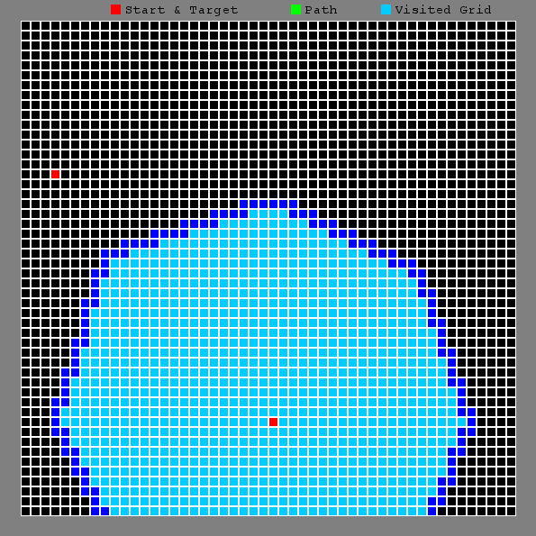

# Path-Finding-Visualizer
Path finding visualizer software application for Windows, Mac OS X and Linux. Code implements various path finding algorithm. Program is made by python.   
  
## Features
* Simple path finding visualizer with BFS, DFS, and A* path finding algorithm
* Supports wall being drawn on the map for test variation

## Install
Program requires pygame installation. Install pygame by typing following command :\

For windows:\
pip install pygame

For Max OS X:\
sudo pip3 install hg+http://bitbucket.org/pygame/pygame

For Linux:\
sudo apt-get install python-pygame

## Compile and run
git clone https://github.com/cshim31/Path-Finding-Visualizer.git \
python Main.py

Once compiled, dialog box will pop and prompt you to type in starting and target (x,y) coordinates and types of algorithm to perform. \
For various simulation under different environment, users are allowed to draw distracting feature (Wall) by keep pressing left mouse-click and drawing on the grid.\
Press "Space" Key to start the program.\

