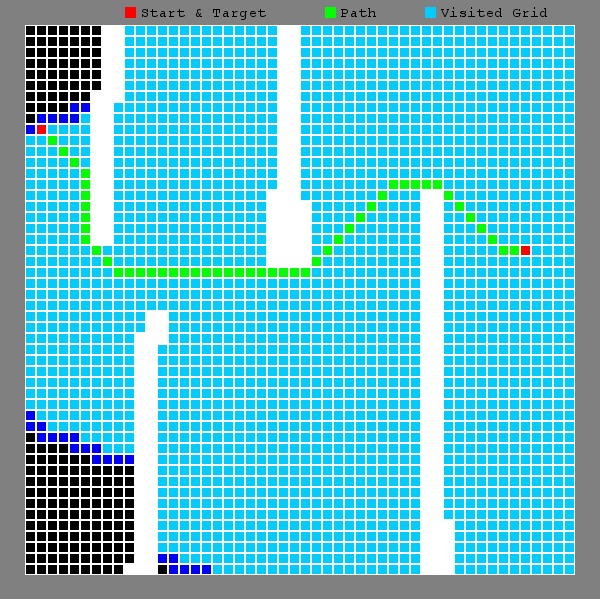

# Path-Finding-Visualizer
Path finding visualizer software application for Windows, Mac OS X and Linux. Code implements various path finding algorithm. Program is made by python.   
  
## Features
* Simple path finding visualizer with BFS, DFS, and A* path finding algorithm
* Supports wall being drawn on the map for test variation

## Install
Program requires pygame installation. Install pygame by typing following command :\

For windows:\
pip install pygame

For Max OS X:\
sudo pip3 install hg+http://bitbucket.org/pygame/pygame

For Linux:\
sudo apt-get install python-pygame

## Compile and run
For git Cloning, type in following command on git bash\
git clone https://github.com/cshim31/Path-Finding-Visualizer.git

Once compiled, type in starting x,y coordinates, destination, and other selections. Then, press "Enter" Key to start the program.\
Then, user can draw the wall by pressing mouse left click. You can create your own wall to test different simulation.

